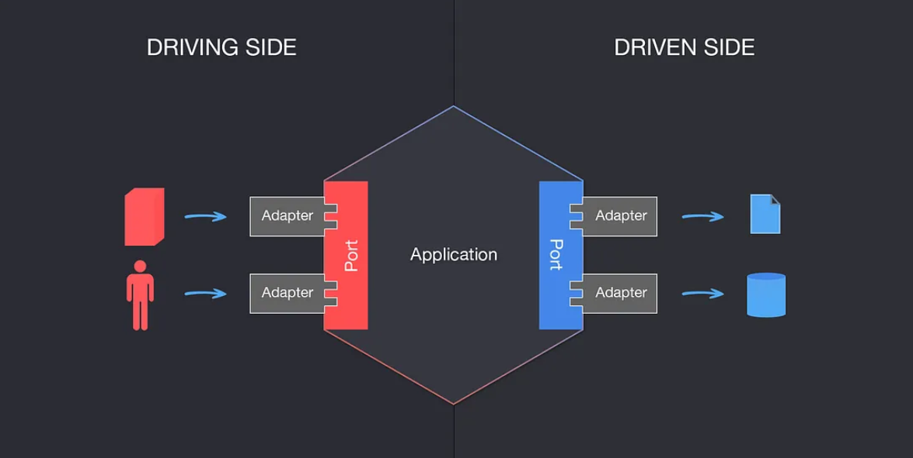

# Getting Started

### About

Simple spring service that retrieves a player profile from database, updates the profile with active campaigns provided
and returns the result.

As database was used in memory H2 for simplicity but any other database server can be configured - depending on the db server, database creation might be required as a prerequisite. (e.g for MYSQL DB application can be configured to auto create the db while for PostgreSql the db needs to exists).  

H2 provides a console for interacting with database, that can be accessed at the next url:   
http://localhost:8080/h2-console   
Configuration needed for H2 console:  
- JDBC URL: jdbc:h2:mem:profile-matcher (the spring.datasource.url key from application.properties configuration file  
- Username: sa (the value for spring.datasource.username key from application.properties configuration file)    
- Password: pass (the value for spring.datasource.password key from application.properties configuration file)

### Configuration

| Key                        | Description                                                                                | Default Value                   | Mandatory |
|----------------------------|--------------------------------------------------------------------------------------------|---------------------------------|-----------|
| spring.datasource.url      | Database url                                                                               | jdbc:h2:mem:profile-matcher     | YES       | 
| spring.datasource.username | Username to connect to database server                                                     | sa                              | YES       |
| spring.datasource.password | Password for the username used to connect to db server                                     | pass                            | YES       |
| campaignServiceUrl         | The url of the campaign service. Currently the base url it's the same with current service | http://localhost:8080/campaigns | YES       |

### API

The service exposes a Rest endpoint for retrieving player profile information.

request type: GET   
url: http://serverIp:port/player-profile/get_client_config/{player_id}
e.g. localhost:  
http://localhost:8080/player-profile/a1a05043-c49f-4b60-a3ee-c025da8ab3ac

### Testing
For testing purposes during startup a player is seeded into database. 
The player id for testing can be loaded from logs, and should look similar to:  
----------------- PLAYER ID TO BE USED FOR TESTING 0b1ef793-02a8-407a-8635-42eb5a2c534b -----------------     

### Architecture

The Hexagonal architecture was used for structuring this service. 
Additional information can be found:
- https://medium.com/ssense-tech/hexagonal-architecture-there-are-always-two-sides-to-every-story-bc0780ed7d9c
- https://www.happycoders.eu/software-craftsmanship/hexagonal-architecture/

The application was written using java 17 and spring boot framework 3.x.   
Junit5 and Mockito were used for unit testing   
The entry point for the application is PlayerProfileController class that exposes the GET Player Profile endpoint.    

### To be improved

- OpenApi library can be added for generating api documentation
- The service can be containerized
- A layer of security can be added 
- For simplicity, in order to Mock the Campaign service, a Controller was created (instead of creating a different service))
- Write additional unit test
- I Didn't understood the purpose of the "_customfield" from the player profile